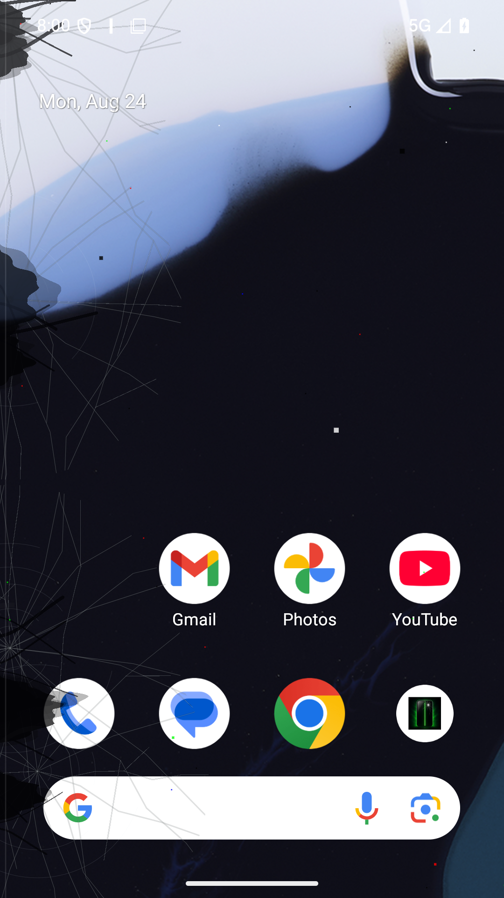

# Display Fault Simulator

[繁體中文](README.md) | English

Display Fault Simulator is an Android app that recreates common panel-failure visuals in a transparent, system-wide overlay. Lines and damage effects are display-only: taps, swipes, and system gestures continue to reach the app underneath.

- Package: `tw.chehu.displayfaultsimulator`
- Languages: English and Traditional Chinese (`zh-TW`), selected from the Android system or per-app language setting
- Android: 8.0+ (API 26), targeting Android 16 (API 36)

> For demonstrations, UI testing, photography, and harmless pranks only. The app does not diagnose or repair a physical display.

## Screenshots

All images below were captured from the v1.9.0 release APK running on an Android 16 emulator. They are not composited mockups.

| v1.9.0 Traditional Chinese settings | v1.9.0 English settings |
| --- | --- |
|  |  |

| Drag scene editor | Deep-black left-edge panel rupture |
| --- | --- |
|  |  |

### Preset effects

These are real full-screen captures from the Android 16 emulator, not composited illustrations.

| Multiple pink lines | Impact-cracked panel | Screen liquid damage |
| --- | --- | --- |
|  |  |  |

| Heavy dead pixels | Aged LCD scanlines | Severe damage |
| --- | --- | --- |
|  |  |  |

## Highlights

- Up to 12 independent vertical lines per scene
- Per-line color, width, opacity, glow, flicker, position, and timed horizontal movement
- Direct line dragging in the visual scene editor
- Layerable spiderweb, radial-impact, corner-shatter, and hairline crack patterns, plus dead/stuck pixels, panel liquid damage, OLED ghosting, and LCD scanlines
- Crack spread and visibility are independently adjustable; edge damage uses irregular deep-black panel ruptures and LCD bleed attached to the bezel
- Up to 6 draggable impact points per scene with rotation, branch count, reach, region masks, chipped edges, shards, reflections, and tilt parallax
- OLED black spots, colored edge bleed, uneven brightness, rainbow shift, pressure spots, tearing, partial blackout, flashes, PWM bands, and cable jumping
- Animated reveal, expanding black spots/liquid, unstable split or recolored lines, event timeline, random faults, and automatic effect cycling
- Shake, flip, charging, and unlock events can trigger the current scene or another selected scene
- Editable custom scenes with create, duplicate, rename, and delete actions
- Countdown start and automatic stop timers
- Quick Settings tile and notification stop action
- Foreground service, optional boot recovery, and battery-optimization guidance
- Full touch-through overlay that does not capture screen content or intercept input

## Built-in preset library

- Classic OLED green line
- Multiple pink lines
- Impact-cracked panel
- Upper-left corner burst
- Lower-left edge drop
- Fold hinge-side hairline cracks
- Multiple left-edge impacts
- Severe left-edge shatter
- Screen liquid damage
- Heavy dead pixels
- Loose display cable
- Aged LCD scanlines
- Light damage
- Expanding OLED decay
- Rainbow pressure damage
- Dynamic intermittent failure
- Severe damage

Applying a preset creates a new editable scene and leaves existing scenes unchanged.

## Install

1. Download the APK from [GitHub Releases](https://github.com/ahui3c/DisplayFaultSimulator_Android/releases).
2. Allow installation from the browser or file manager when Android asks.
3. Open the app and grant **Display over other apps**.
4. Choose or edit a scene, then tap **Start or schedule display**.
5. Stop the effect from the app, persistent notification, or Quick Settings tile.

The APK attached to the current GitHub release is development-signed for direct sideload testing. A future store or production distribution should use a private production signing key.

## Permissions and privacy

| Permission | Purpose |
| --- | --- |
| Display over other apps | Draw the transparent damage overlay above other apps |
| Notifications | Keep the user-controlled foreground service visible and provide Stop |
| Foreground service | Keep an active or scheduled effect running |
| Boot completed | Optionally restore an unfinished effect after restart |
The app does not capture screen content, use the network, or collect, share, or transmit personal data. Scenes and settings remain on the user's device.

## Build from source

Requirements: Android Studio/JDK 17 and Android SDK 36.

```powershell
.\gradlew.bat assembleDebug lintDebug
```

For the optimized release variant:

```powershell
.\gradlew.bat assembleRelease
```

Android requires every update to use a compatible signing certificate. Copy `keystore.properties.example` to the Git-ignored `keystore.properties` and configure the key used by previous releases; both Debug and Release then use that consistent certificate. Without this file, Gradle falls back to the environment's default debug key and the Release build may remain unsigned, so it must not be published.

## Android limitations

- Manually force-stopping the app prevents Android from restarting it until the user opens it again.
- Some manufacturers require separate auto-start, background-run, or recent-app-lock settings.
- Battery-optimization exemption improves persistence but cannot guarantee that every vendor will keep the process alive.
- Security-sensitive system windows, such as permission dialogs, may appear above the overlay by Android design.
- Since v1.4.0 the package is `tw.chehu.displayfaultsimulator`; it installs separately from the older `tw.chehu.fungreenline` package and does not import its scenes.

## License

MIT License. See [LICENSE](LICENSE).
