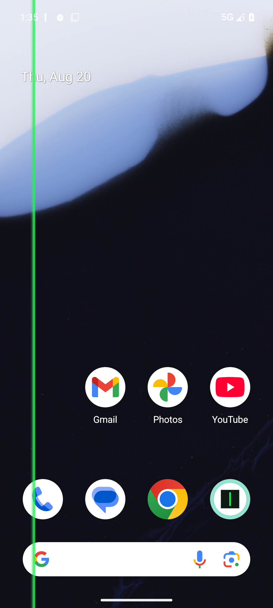
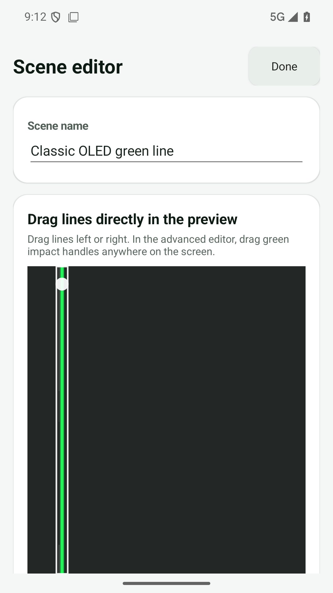
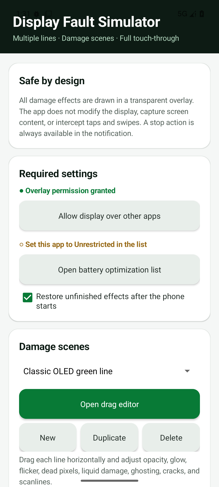
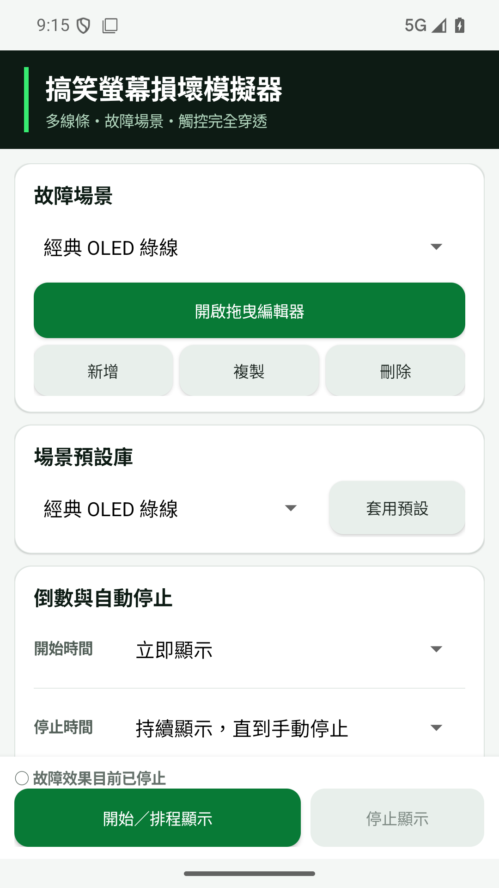
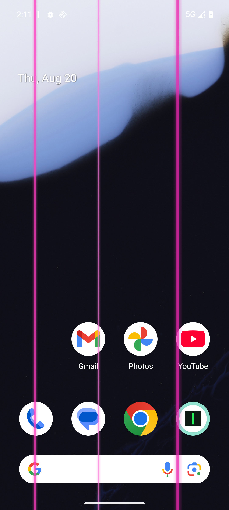
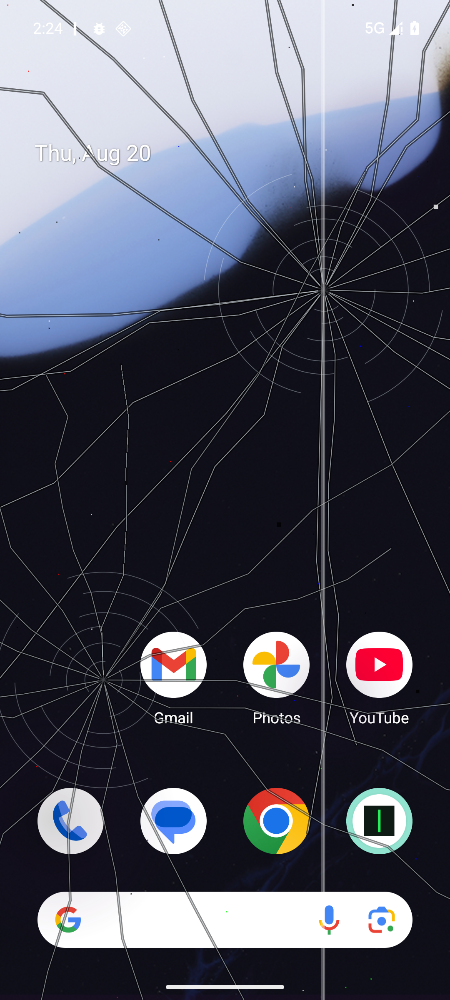
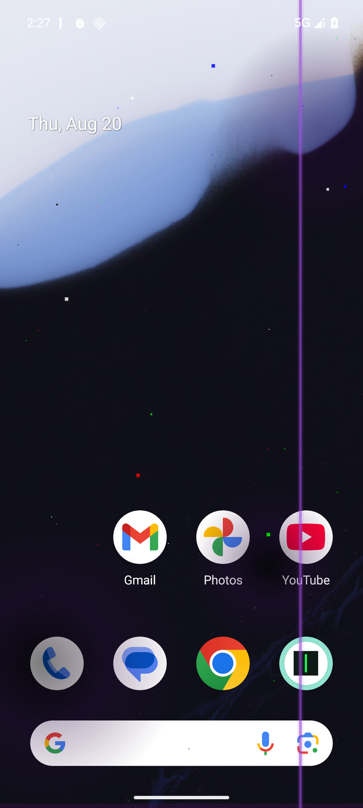
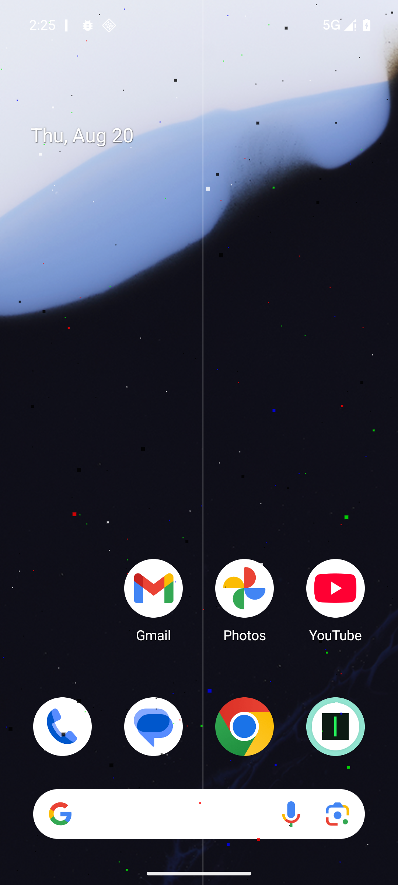
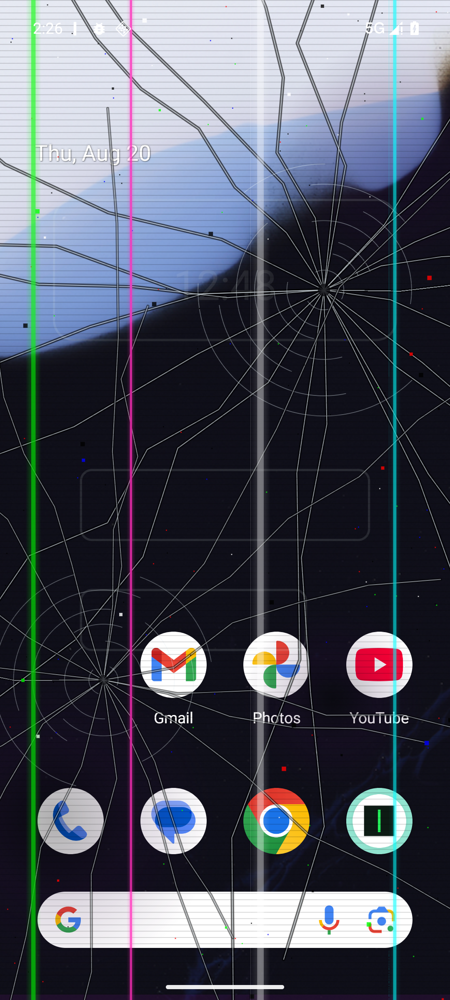

# Display Fault Simulator（螢幕故障模擬器）

繁體中文 | [English](README.en.md)

Display Fault Simulator 是 Android 螢幕面板故障效果模擬工具，透過透明的系統上層視窗呈現綠線、破裂、漏液等視覺效果。所有效果都只負責顯示，點按、滑動與系統手勢仍會傳給下方原本的 App。

- 套件名稱：`tw.chehu.displayfaultsimulator`
- 介面語言：英文與繁體中文（`zh-TW`），跟隨 Android 系統或個別 App 語言設定
- 支援版本：Android 8.0 以上（API 26），目標 Android 16（API 36）

> 僅供展示、介面測試、拍攝與無害惡作劇使用；本 App 無法診斷或修復實體螢幕。

## 螢幕截圖

以下畫面由 Android 16 模擬器實際執行後擷取。桌面覆蓋畫面可確認線條完整延伸到螢幕實體頂端與底端，包含狀態列及導覽列區域。

| 全螢幕覆蓋效果 | 場景編輯器 |
| --- | --- |
|  |  |

| 英文介面 | 繁體中文介面 |
| --- | --- |
|  |  |

### 預設場景效果

以下圖片同樣是 Android 16 模擬器的實際全螢幕執行畫面，不是合成示意圖。

| 多條粉紅線 | 面板摔傷破裂 | 螢幕漏液 |
| --- | --- | --- |
|  |  |  |

| 大量壞點 | 老舊 LCD 掃描線 | 嚴重故障 |
| --- | --- | --- |
|  |  |  |

## 主要功能

- 每個場景最多 12 條獨立垂直線
- 每條線可設定顏色、粗細、透明度、光暈、閃爍、位置與定時左右微移
- 在視覺化場景編輯器中直接拖曳線條
- 可疊加蜘蛛網、放射撞擊、邊角碎裂、髮絲裂紋等破裂樣式，以及壞點／亮點、面板漏液、OLED 殘影與 LCD 掃描線
- 裂紋延伸範圍與可見度可分別調整，內建破裂預設採較淡的透明玻璃質感
- 每個場景最多 6 個可拖曳撞擊點，並可調整旋轉、分支、長度、遮罩、缺角、碎片、反光與方向視差
- OLED 黑斑、彩色漏液邊緣、亮度不均、彩虹色偏、壓傷光斑、橫向撕裂、半屏黑屏、閃屏、PWM 條紋與排線跳動
- 故障逐步出現、黑斑／漏液擴散、線條分裂變色、事件時間軸、隨機模式及自動循環
- 可由搖晃、翻轉、開始充電或解鎖事件觸發目前或指定場景
- 可新增、命名、複製與刪除自訂場景
- 支援倒數啟動與自動停止
- 快速設定磁貼與通知列停止按鈕
- 一鍵檢查 GitHub Release；發現新版時自動下載、驗證並開啟 Android 更新安裝畫面
- 前景服務、選用的開機恢復及電池最佳化設定引導
- 上層畫面完全穿透觸控，不截取螢幕內容，也不攔截任何操作

## 內建場景預設庫

- 經典 OLED 綠線
- 多條粉紅線
- 面板摔傷破裂
- 螢幕漏液
- 大量壞點
- 排線接觸不良
- 老舊 LCD 掃描線
- 輕微故障
- OLED 黑斑擴散
- 彩虹壓傷
- 動態間歇故障
- 嚴重故障

套用預設時會新增一個可自由修改的場景，不會覆蓋現有場景。

## 安裝與使用

1. 從 [GitHub Releases](https://github.com/ahui3c/DisplayFaultSimulator_Android/releases) 下載 APK。
2. Android 詢問時，允許瀏覽器或檔案管理器安裝未知來源 App。
3. 開啟 App 並授予「顯示在其他應用程式上層」權限。
4. 選擇或編輯場景，再點選「開始／排程顯示」。
5. 可從 App、常駐通知或快速設定磁貼停止效果。

目前 GitHub Release 附上的 APK 使用開發用簽章，適合直接側載測試；未來若上架商店或正式散布，應改用私密的正式簽章金鑰。

## 權限與隱私

| 權限 | 用途 |
| --- | --- |
| 顯示在其他應用程式上層 | 在其他 App 上方繪製透明故障效果 |
| 通知 | 顯示使用者可控制的前景服務與停止按鈕 |
| 前景服務 | 維持正在顯示或已排程的效果 |
| 開機完成 | 依使用者設定恢復尚未結束的效果 |
| 網路 | 僅在使用者按下「檢查線上更新」後讀取 GitHub Release 資訊並下載新版 APK |
| 安裝未知應用程式 | 將已驗證的新版 APK 交給 Android 系統安裝程式更新；仍須由使用者確認 |

本 App 不會截取螢幕，也不會蒐集或傳送個人資料。網路功能只在使用者手動開啟線上更新頁面時使用；APK 會在安裝前檢查 SHA-256（Release 有提供時）、包名、版本碼及簽署憑證。

## 從原始碼建置

需要 Android Studio／JDK 17 與 Android SDK 36。

```powershell
.\gradlew.bat assembleDebug lintDebug
```

建立最佳化 Release 版本：

```powershell
.\gradlew.bat assembleRelease
```

為了讓 Android 可以覆蓋安裝與使用線上更新，每次發布都必須使用相同簽章。可將 `keystore.properties.example` 複製為被 Git 忽略的 `keystore.properties` 並填入既有金鑰；設定完成後，Debug 與 Release 都會使用該固定簽章。若沒有設定，Gradle 會使用環境預設的 Debug 金鑰，Release 則可能保持未簽章，不適合發布。

## Android 限制

- 使用者手動「強制停止」後，Android 會阻止 App 自行恢復，必須再次手動開啟。
- 部分廠牌另有自動啟動、背景執行或鎖定最近使用 App 等專屬設定。
- 排除電池最佳化可提高常駐能力，但無法保證所有廠牌都永不終止程序。
- 權限對話框等安全性較高的系統視窗可能顯示在線條上方，這是 Android 的設計。
- v1.4.0 起套件名稱改為 `tw.chehu.displayfaultsimulator`，會與舊版 `tw.chehu.fungreenline` 分開安裝，舊版場景不會自動匯入。

## 授權

採用 MIT License，請參閱 [LICENSE](LICENSE)。
